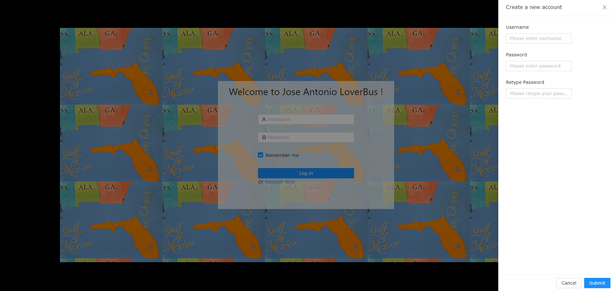
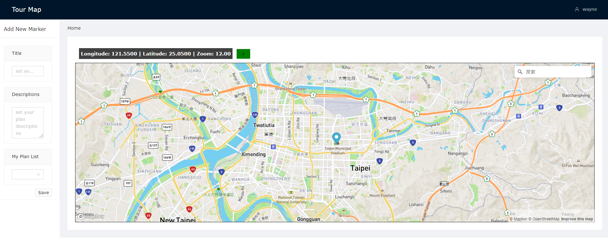
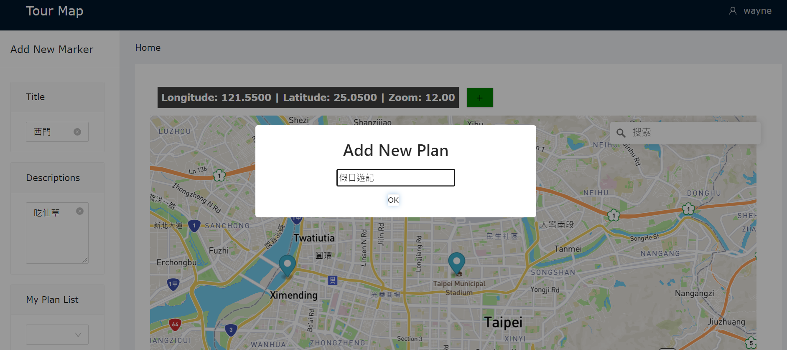

# Jose-Antonio_LoverBus
> Jose Antonio LoverBus is a project of a lover bus.
> The website will show a map that where the lover bus is.
> Catch up and hold up on it!

The website allows users to record their certain feelings and expectation about a place. They can also plan a new trip with this website.  Join us and have fun in your journey!

## Authors
| 組員             | 貢獻                           |
| ---------------- | ------------------------------ |
| B06901045 曹林熹 | 前端設計、前後端架構連結       |
| B06901141 何俊緯 | 前後端架構連結、後端伺服器架設 |
| B06901041 許誠   | 前端設計、影片剪輯             |

[Demo 影片](https://www.youtube.com/watch?v=nlLpOqNpUfY), [Deploy Link](https://jose-antonio-lover-bus.herokuapp.com)

## Run locally
```
cd frontend
vim .env # write down your mapbox-gl access token
yarn
yarn start

cd ../backend
vim .env # write down your mongoose-url
yarn
yarn start
```

## Tools

<p float=left>


</p>

## 專題製作心得：
* B06901045 曹林熹：這次與組員們花了很多心力做出了這個成品，起初分工的部分明確分出前端與後端，讓兩邊在更新程式碼時效率比較高。到後期由於我們開的功能蠻多的，因此在做 query, mutation, subscribe 時相較困難了一點，因為同一個 js 檔中有很多的東西會改，改前端的同時也要搭配後端，因此在不使用 branch 時常常 merge conflict。最後，這份專題我們都很滿意，因為我們三個都喜愛旅遊，想要自己建立一個 bucket list 出來，能夠克服 graphql 與 apollo 打造自己的網頁實在是很開心！

* B06901141 何俊緯：因為期末的關係，這次專題比較晚開始。雖然有點遺憾來不及完成一開始計畫的跨使用者揪團、旅遊資訊分享功能，但以一個個人旅遊計畫網站而言，也可以說是五臟俱全了。很感謝組員在我期末大爆炸的時候 cover 我，感謝曹林熹設計出了精美的前端和 css，感謝許誠找到 mapbox-gl 這樣好用的免費開源軟體，也謝謝教授和助教讓我從完全不會寫 HTML,CSS,  JavaScript 到可以寫出一個完整的應用。這一切要感謝的人太多，我不能多做甚麼，只希望大家喜歡我們設計的服務，有機會的話我也會寫一些更有趣的應用來服務大家。

## Usage
1. Create an account
   
2. Create a marker by clicking the map or using the search box on top of the map
   
3. Input title and description to record your experience or your expectation about a place
   
4. Create a plan and save locations into plans
   
5. Choose a plan in your plan list
   
6. Modify your staying time in a place
   